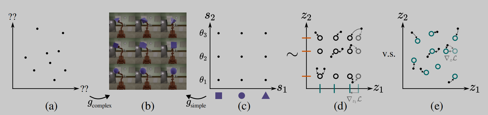
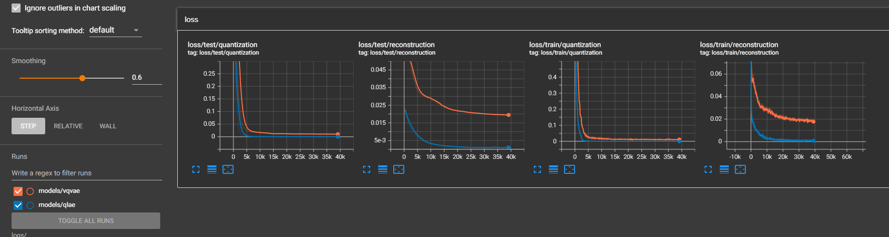
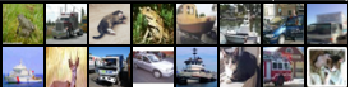
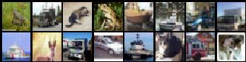
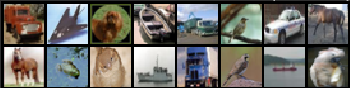
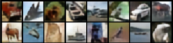

## Reproducing Disentanglement via Latent Quantization

The unofficial implementation of paper [Disentanglement via Latent Quantization](https://arxiv.org/pdf/2305.18378v1.pdf)



### Instructions
1. To train the QLAE with default arguments as discussed in the report, execute:
```
python qlae.py --data-folder /tmp/miniimagenet --output-folder models/qlae
```
2. To train the PixelCNN prior on the latents, execute:
```
python pixelcnn_prior.py --data-folder /tmp/miniimagenet --model models/qlae --output-folder models/pixelcnn_prior
```
### Datasets Tested
#### Image
1. MNIST
2. FashionMNIST
3. CIFAR10
4. Mini-ImageNet

### Training and test curves for QLAE



### Reconstructions from QLAE and VQVAE
Top 2 rows are Original Images. Bottom 2 rows are Reconstructions.
#### CIFAR-10 
#### QLAE





#### VQVAE






### Acknowledgements

The code is heavily rely on the [repository](https://github.com/ritheshkumar95/pytorch-vqvae) and we thank for their contribution.
